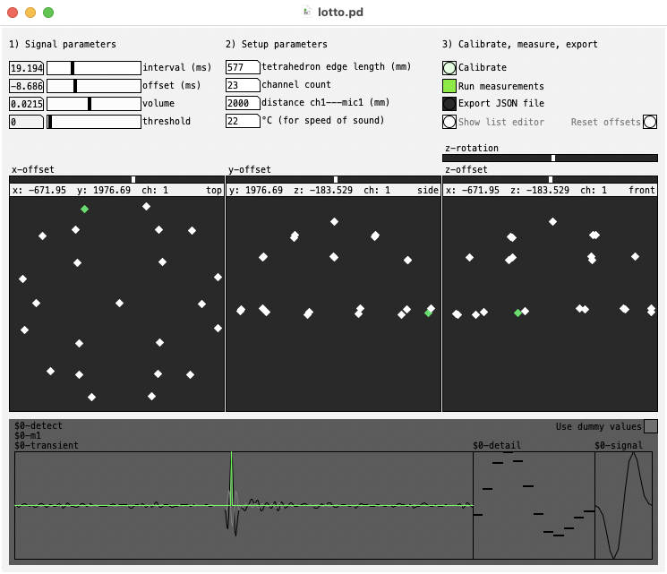

# LOTTO (Localize OTTOsonics)
Pure Data (Pd) GUI tool for automatic speaker localization in spatial audio setups

## Instructions

* Measure and calibrate distance of speaker on channel 1 to microphone 1
* Place microphone array inside spatial speaker setup
* Run continuous measurements (playing back impulses in ~20ms intervals)
* Fine-tune parameters
* Stop measurements and export to JSON
